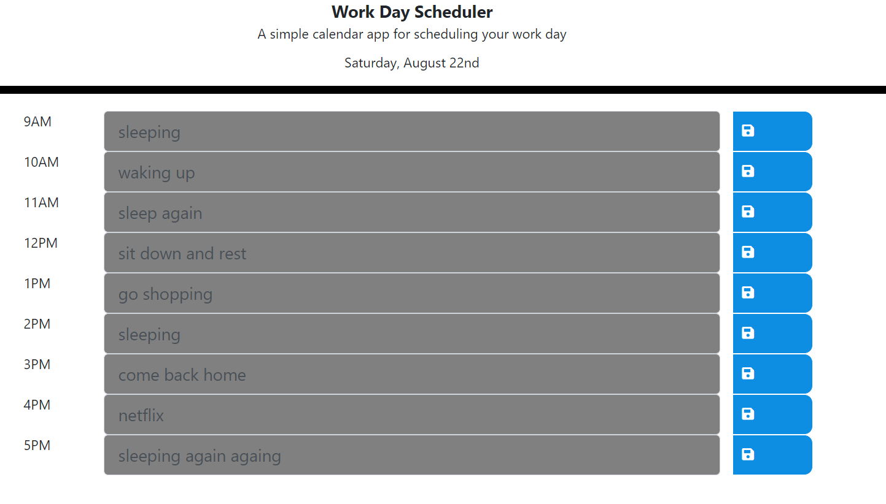

# Work_Day_Scheduler

Hello,

This App is a work day scheduler where tasks can be put between 9AM and 5PM seperated by hour.

+Hours passed are colored in grey.
+Current hour is colored in red.
+Future hours are colored in green.
+In order to save the task, user needs to click on the icon on the right.
+This App uses local storage. 
+Once the day is passed, tasks are to be deleted automatically once browser is reloaded.
+This app uses moment.js, jQuery, Bootstrap, Fontawesome and Ajax.
